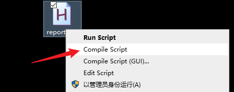
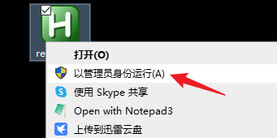

# 🔥ReportShortcut

使用快捷键辅助输入学号和姓名。欢迎 star🌟、issue、PR。

## 🚀快速开始

### 🌴安装与配置

- 在[这里](https://www.autohotkey.com/)下载最新版的 `AutoHotKey`
- 使用记事本或编辑器打开 `report.ahk`，修改其中的学号和姓名

### 📖使用方法

1. 右键，点击 `compile` 进行编译，得到可执行的二进制文件，或者直接选择 `run` 。

2. 如果上一步选择进行编译，那么右键可执行文件，选择 `以管理员身份运行` ，之后可以在底部状态栏中右键选择退出。

3. 在表单中按快捷键填表：
    - `Ctrl + j`：输入学号+姓名
    - `Alt + j`：输入姓名+学号

## 🔒LICENSE

GNU GPLv3.0
